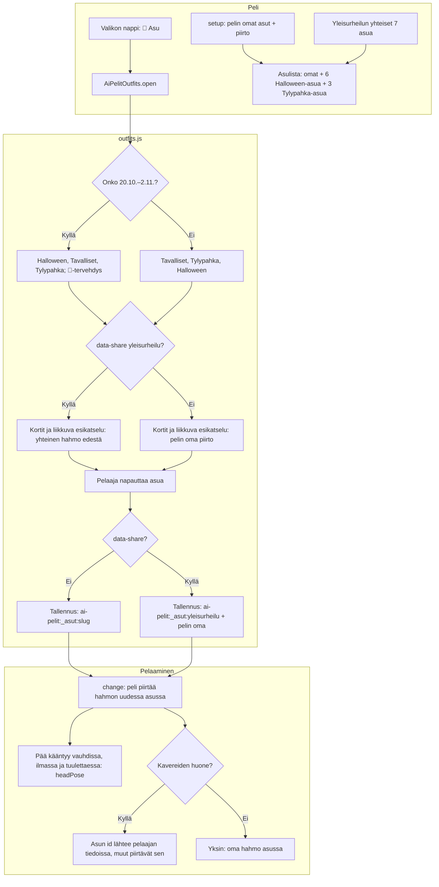

# Asut: the shared outfit picker, Halloween and Tylypahka costumes

How a game version lets the player pick an outfit for their figure (#158). One shared script,
`public/outfits.js`, draws the picker and keeps the choice on the phone; each game draws its own
figure in the chosen outfit. The six Halloween costumes are the same in every game, always
available, and come first in the picker around Halloween. From #311 the athletics events share
one choice (`data-share="yleisurheilu"`) and one set of everyday kits, so the outfit picked in
any of them is worn in every event (Mäkihyppy too from v12, #469; Ottelu, which shared it, was
removed in #469). The three Tylypahka
costumes (#321: Harry, Ron and Hermione) are in every game too, right after the everyday outfits.

```mermaid
flowchart TD
  subgraph Peli
    A[Valikon nappi: 👕 Asu] --> B[AiPelitOutfits.open]
    S[setup: pelin omat asut + piirto] --> L[Asulista: omat + 6 Halloween-asua + 3 Tylypahka-asua]
    Y[Yleisurheilun yhteiset 7 asua] --> L
  end
  subgraph outfits.js
    B --> Q{Onko 20.10.–2.11.?}
    Q -- Kyllä --> H[Halloween, Tavalliset, Tylypahka; 🎃-tervehdys]
    Q -- Ei --> T[Tavalliset, Tylypahka, Halloween]
    H --> F{data-share yleisurheilu?}
    T --> F
    F -- Ei --> K[Kortit ja liikkuva esikatselu: pelin oma piirto]
    F -- Kyllä --> FK[Kortit ja liikkuva esikatselu: yhteinen hahmo edestä]
    FK --> P
    K --> P[Pelaaja napauttaa asua]
    P --> G{data-share?}
    G -- Ei --> V[Tallennus: ai-pelit:_asut:slug]
    G -- Kyllä --> W[Tallennus: ai-pelit:_asut:yleisurheilu + pelin oma]
  end
  subgraph Pelaaminen
    V --> C[change: peli piirtää hahmon uudessa asussa]
    W --> C
    C --> HP[Pää kääntyy vauhdissa, ilmassa ja tuulettaessa: headPose]
    C --> R{Kavereiden huone?}
    R -- Kyllä --> M[Asun id lähtee pelaajan tiedoissa, muut piirtävät sen]
    R -- Ei --> D[Yksin: oma hahmo asussa]
  end
  class A,P blue
  class S,L,K,FK,Y violet
  class Q,R,G,F amber
  class H,T teal
  class V,W green
  class C,M,D,HP rose
```

## Colours

- **blue**: what the player taps
- **violet**: the game's own outfits and drawing
- **amber**: a check that decides the path
- **teal**: the picker's order
- **green**: the save on the phone
- **rose**: the figure in the game

## Boxes

- **Valikon nappi: 👕 Asu**: the menu button each game draws; shows the outfit now, e.g. "👕 Asu: Kurpitsa".
- **setup: pelin omat asut + piirto**: `AiPelitOutfits.setup({outfits, draw, change})` in the game's script; the first own outfit is the default.
- **Asulista: omat + 6 Halloween-asua + 3 Tylypahka-asua**: `HALLOWEEN` in `public/outfits.js`: Kurpitsa, Noita, Haamu, Luuranko, Vampyyri, Muumio, and `TYLYPAHKA`: Harry, Ron, Hermione (black robe as the cape, house scarf, own hair; Harry's glasses and scar), each a palette plus a costume head drawn by `AiPelitOutfits.head()`. Orava's squirrel reads their `fur` colours instead.
- **Halloween, Tavalliset, Tylypahka**: `fill()` in `public/outfits.js`; on a low sideways screen each group's name is a small cell before its cards, so all of them fit without scrolling.
- **Onko 20.10.–2.11.?**: `season()` in `public/outfits.js`.
- **data-share yleisurheilu?**: `FIGURE` in `public/outfits.js` (#469): `SHARE === 'yleisurheilu'`.
- **Kortit ja liikkuva esikatselu: pelin oma piirto**: `fill()` draws each card with the game's `draw`, and `preview()` puts a 150 px canvas (`#ai-pelit-asut-esikatselu`) at the top where the game's own figure hops in the outfit the player taps; Orava, Trampoliini and Voimistelu keep their own figure (Eero's choice, #469). On a low sideways screen the preview is left out.
- **Kortit ja liikkuva esikatselu: yhteinen hahmo edestä**: `figure(ctx, dress(o), …)` in `public/outfits.js`, the front-facing athlete the podium and spectators of `lib/yleisurheilu-10/` draw too; costume heads face forward (`frontHead()`), and the preview's figure looks around, nods and cheers.
- **Pää kääntyy vauhdissa, ilmassa ja tuulettaessa: headPose**: `AiPelitOutfits.headPose(state, t)` (#469) returns `{tilt}` for `run` (a bob with the stride), `takeoff`, `air` (back), `land` (chin down), `cheer` and `idle`; Korkeushyppy v15, Pituushyppy v18, Keihäs v17, Kuula v11 and Seiväshyppy v16 pass it to `AiPelitOutfits.sideHead()` (a `headTilt(a)` of their own picks the state), Mäkihyppy v12 adds it to its head angle in `drawJumper()`. Drawing only: no result reads it.
- **Tallennus: ai-pelit:_asut:slug**: one key per game, shared by all its versions.
- **Yleisurheilun yhteiset 7 asua**: `AiPelitOutfits.yleisurheilu` in `public/outfits.js` (#311): Perus, Sinivalkoinen, Musta, Punainen, Vihreä, Kulta, Neon, the ids the events had on their own, so an earlier choice is found. Used from Pituushyppy v10, Korkeushyppy v6, Seiväshyppy v7, Moukari v6, Keihäs v9, Kuula v3, Aitajuoksu v10 and Mäkihyppy v12 (Ottelu v7 used them until it was removed, #469).
- **data-share?**: `data-share="yleisurheilu"` on the script tag. `current()` reads the shared key. The first time a phone opens a game of the group, `adopt()` makes an earlier choice the group's: the first valid one in the fixed order of `SHARED_FROM` (Keihäs, Aitajuoksu, Kuula, then the game itself), so every game shows the same outfit whichever opens first.
- **Tallennus: ai-pelit:_asut:yleisurheilu + pelin oma**: a pick is saved under both keys, so the game's older versions, which read only their own, follow it too.
- **Asun id lähtee pelaajan tiedoissa, muut piirtävät sen**: Aitajuoksu sends the outfit id with the runner, the field events through the athletics library's `fit` option (`kisa.js`); a phone on an older version just draws its normal look.
